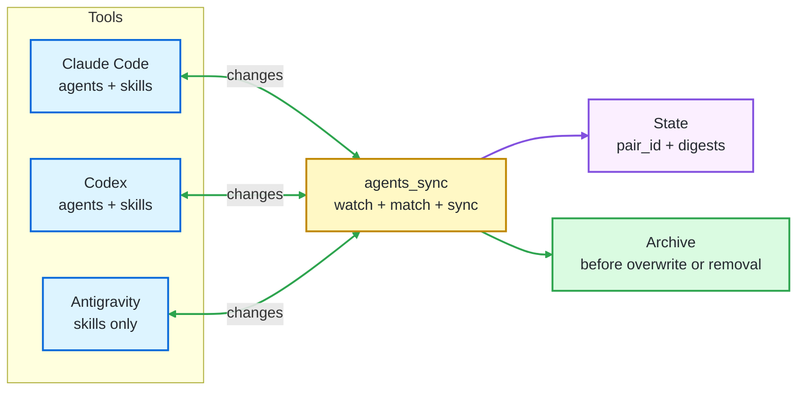

<p align="center">
  
</p>

<h1 align="center">agents_sync</h1>

<p align="center">
  
  
  
  
  
  
</p>

## 🎯 Purpose

`agents_sync` keeps your user-level custom agents and skills in sync across **Claude Code**, **Codex**, and **Google Antigravity**.

> Build your AI workflow once and use it from every tool you've installed. Create or edit a skill in Claude Code and it appears in Codex and Antigravity. Edit it in Antigravity and it comes back to Claude Code and Codex. Agents sync between Claude Code and Codex (Antigravity has no stable per-agent file format yet).

The daemon runs quietly in the background, protects your content with archives, and keeps user-level files connected even when they are renamed. If one of the tools isn't installed, that tool is silently skipped — the others continue to sync.

---

## 🗂️ Table Of Contents

- [What It Syncs](#what-it-syncs)
- [Bidirectional Sync](#bidirectional-sync)
- [Quick Start](#quick-start)
- [Daily Usage](#daily-usage)
- [Check That It Is Running](#check-that-it-is-running)
- [Run In Foreground For Debugging](#run-in-foreground-for-debugging)
- [Manage The Background Service](#manage-the-background-service)
- [Uninstall](#uninstall)
- [Default Paths](#default-paths)
- [Notes](#notes)
- [Changelog](#changelog)
- [Documentation](#documentation)
- [License](#license)

---

<a id="what-it-syncs"></a>

## 🧩 What It Syncs

`agents_sync` synchronizes user-level skills across Claude Code, Codex, and Google Antigravity. Agents are tracked on Claude Code only (the other tools have no per-agent file format).

| What you edit | Claude Code | Codex | Antigravity |
|:---|:---|:---|:---|
| Agents | `~/.claude/agents/*.md` | — (uses a single `~/.codex/AGENTS.md`) | — (no per-agent format) |
| Skills | `~/.claude/skills/*/SKILL.md` | `~/.codex/skills/*/SKILL.md` | `~/.gemini/antigravity/skills/*/SKILL.md` |

**In plain terms:**

- Skills are reusable instruction folders. All three tools use the same open `SKILL.md` spec, so skills sync three ways.
- Agents are reusable AI personas. Only Claude Code keeps them as per-agent files; Codex collapses its global guidance into a single `AGENTS.md`. Until another tool adopts a per-agent file format, claude agents are tracked locally but have no projection target.



---

<a id="bidirectional-sync"></a>

## 🔁 Bidirectional Sync

`agents_sync` treats every configured tool as an equal peer. Edit on any one tool and the change propagates to every other tool that supports the same kind of customization.

| Action | Result |
|:---|:---|
| Create or edit a Claude Code agent | Codex receives the matching `.toml` file |
| Create or edit a Codex agent | Claude Code receives the matching `.md` file |
| Create or edit a skill on any tool | The other two tools receive the matching `SKILL.md` folder |
| Two or more tools edit the same skill simultaneously | The most recently modified copy wins; the losers are archived |
| Remove a synced agent or skill on any tool | The other tools' copies are archived, then removed |
| A tool's directory is missing at startup | That tool is marked unavailable; the others continue to sync, and nothing is interpreted as a deletion |

---

<a id="quick-start"></a>

## ⚡ Quick Start

### Linux

**Install `uv` if needed:**

```bash
curl -LsSf https://astral.sh/uv/install.sh | sh
```

**Install and start `agents_sync`:**

```bash
chmod +x install.sh
./install.sh
```

### Windows

**Install `uv` if needed:**

```powershell
winget install --id=astral-sh.uv -e
```

**Install and start `agents_sync`:**

```powershell
powershell -ExecutionPolicy Bypass -File .\install.ps1
```

The Windows installer registers a per-user scheduled task. It starts at logon without opening a terminal window.

### macOS

**Install `uv` if needed:**

```bash
curl -LsSf https://astral.sh/uv/install.sh | sh
```

**Install and start `agents_sync`:**

```bash
chmod +x install-macos.sh
./install-macos.sh
```

The macOS installer registers a per-user LaunchAgent. It starts at login and keeps the daemon running in the background.

Verify it with [Check That It Is Running](#check-that-it-is-running).

### Enabling Antigravity

Antigravity is enabled by default. The daemon creates `~/.gemini/antigravity/skills/` at startup if it does not already exist, so the first poll syncs claude's and codex's skills into it. Antigravity itself picks up the directory on its next read.

To disable Antigravity entirely, set `antigravity_enabled = false` in your `config.toml`, or pass `--no-antigravity-enabled` on the command line. A disabled tool's roots are not created. The skills directory can be relocated with `antigravity_skills_dir` in `config.toml` or `--antigravity-skills-dir`.

---

<a id="daily-usage"></a>

## 🛠️ Daily Usage

After installation, there is nothing else to start manually:

- Linux runs `agents_sync` as a `systemd --user` service.
- macOS runs `agents_sync` as a per-user LaunchAgent.
- Windows starts it through Task Scheduler when you log in.

Use Claude Code or Codex normally. Create, edit, rename, or remove agents and skills from either side; matching changes propagate automatically. Removals archive the opposite side before cleanup, and existing pairs keep their identity through `pair_id`.

---

<a id="check-that-it-is-running"></a>

## ✅ Check That It Is Running

This section only checks the background daemon. It confirms that the service exists, that it is active, and that the watcher has started writing logs.

### Linux

On Linux, `systemctl` shows the status of the per-user service. `journalctl` shows the latest service logs, which is the quickest way to confirm that `agents_sync` is watching your files.

```bash
systemctl --user status agents-sync.service
journalctl --user -u agents-sync.service -n 20
```

### Windows

On Windows, the scheduled task is the background launcher. After you log in, it should exist and stay in the `Running` state while the daemon is active.

```powershell
Get-ScheduledTask -TaskName agents-sync
```

**Expected state:**

```text
Running
```

**Recent logs:**

The log file confirms that the watcher loop has actually started.

```powershell
Get-Content "$env:LOCALAPPDATA\agents-sync\logs\agents-sync.log" -Tail 20
```

**Expected log line:**

```text
INFO Watching Claude agents/skills with SHA256 polling
```

### macOS

On macOS, `launchctl` shows the status of the per-user LaunchAgent. The installer writes stdout and stderr logs under `~/Library/Logs/agents-sync/`.

```bash
launchctl print "gui/$(id -u)/com.agents-sync.daemon"
tail -n 20 ~/Library/Logs/agents-sync/agents-sync.log
```

---

<a id="run-in-foreground-for-debugging"></a>

## 🔎 Run In Foreground For Debugging

The normal install runs the daemon in the background. Use foreground mode only when debugging. Stop with `Ctrl-C`.

### Linux

```bash
agents-sync --config ~/.config/agents-sync/config.toml --verbose
```

### Windows

```powershell
& "$env:LOCALAPPDATA\agents-sync\bin\agents-sync.cmd" --config "$env:APPDATA\agents-sync\config.toml" --verbose
```

### macOS

```bash
agents-sync --config ~/.config/agents-sync/config.toml --verbose
```

---

<a id="manage-the-background-service"></a>

## ⚙️ Manage The Background Service

### Linux

```bash
systemctl --user stop agents-sync.service
systemctl --user start agents-sync.service
journalctl --user -u agents-sync.service -f
```

### Windows

```powershell
Stop-ScheduledTask -TaskName agents-sync
Start-ScheduledTask -TaskName agents-sync
Get-Content "$env:LOCALAPPDATA\agents-sync\logs\agents-sync.log" -Tail 50
```

### macOS

```bash
launchctl bootout "gui/$(id -u)" ~/Library/LaunchAgents/com.agents-sync.daemon.plist
launchctl bootstrap "gui/$(id -u)" ~/Library/LaunchAgents/com.agents-sync.daemon.plist
tail -f ~/Library/Logs/agents-sync/agents-sync.log
```

---

<a id="uninstall"></a>

## 🧹 Uninstall

### Linux

```bash
./uninstall.sh
```

### Windows

Remove the scheduled task and launchers:

```powershell
powershell -ExecutionPolicy Bypass -File .\uninstall.ps1
```

Also remove config and state:

```powershell
powershell -ExecutionPolicy Bypass -File .\uninstall.ps1 -CleanupData
```

---

<a id="default-paths"></a>

## 📁 Default Paths

| Platform | Config | State | Logs |
|:---|:---|:---|:---|
| Linux | `~/.config/agents-sync/config.toml` | `~/.local/state/agents-sync/` | `journalctl --user -u agents-sync.service` |
| macOS | `~/.config/agents-sync/config.toml` | `~/.local/state/agents-sync/` | `~/Library/Logs/agents-sync/agents-sync.log` |
| Windows | `%APPDATA%\agents-sync\config.toml` | `%LOCALAPPDATA%\agents-sync\state\` | `%LOCALAPPDATA%\agents-sync\logs\agents-sync.log` |

**State layout:**

```text
state.json                                pair_id -> paths and digests
canonical/<pair_id>.json                  one canonical document per pair
archive/<pair_id>/<side>/<filename>.<ISO> preserved prior bytes
```

---

<a id="notes"></a>

## 📝 Notes

- The daemon polls every configured tool at a configurable interval.
- First sight of any agent or skill file without a `pair_id` triggers adoption.
- Adoption archives the original, injects a `pair_id`, and creates the counterpart on every other tool that supports that kind of customization.
- Removing a synced agent or skill on any one tool archives every surviving tool's copy before removing it.
- On startup the daemon creates each enabled tool's configured roots (`mkdir -p`) so a fresh install where the tool hasn't authored anything yet still comes up `available`. If creating a root fails (permission denied, parent is a file), or a root disappears mid-life (drive unmounted, tool uninstalled), the tool flips to `unavailable` for that poll and the daemon keeps running over the remaining `available` tools — your library stays intact (US-11).
- Malformed `pair_id`s, duplicate IDs, and target path collisions are skipped with errors instead of being adopted or overwritten.
- **Antigravity on Windows:** Antigravity v1.19.6 has a known bug where the user-level skills directory is read as `~/.gemini/antigravity/global_skills/` instead of `skills/`. The daemon does not auto-detect this; if you are on an affected version, set `antigravity_skills_dir` to your `global_skills` path in `config.toml`.
- This tool was developed with the support of Claude Code, Codex, and Google Antigravity.

---

<a id="changelog"></a>

## 🗓️ Changelog

### 0.4.0

- Added Google Antigravity as a third agentic tool. Antigravity participates in skills only.
- Codex is now skills-only too. v0.3 assumed Codex used per-agent `.toml` files under `~/.codex/agents/`, but the real Codex layout is a single global `~/.codex/AGENTS.md`. The `codex_agents_dir` config key and `--codex-agents-dir` CLI flag are removed; Codex's per-agent `codex_io` functions stay in the codebase for any future Codex release that adds a per-agent format.
- The default `codex_skills_dir` is now `~/.codex/skills` (the path Codex's own `skill-installer` and `skill-creator` use). The v0.3-era `~/.agents/skills` default never matched a live Codex install.
- Daemon-projected counterparts use the bare slugified name. The v0.3 `-skill` / `-agent` suffix is dropped — agents and skills live in distinct config-keyed roots, so kind disambiguation is unnecessary. A skill named `formatter` now lives at `<root>/formatter/SKILL.md` on every tool instead of `<root>/formatter-skill/SKILL.md`.
- On startup the daemon creates each enabled tool's roots if they don't exist (`mkdir -p`). Mid-life loss of a root still flips a tool to `unavailable` per US-11.
- Agents (per-agent files) are therefore Claude-only in v0.4. Adoption still mints and injects a `pair_id` so your Claude agents are ready to sync if another tool ever adopts a per-agent file format.
- Generalised the sync algorithm from two named peers (`claude` / `codex`) to an N-tool registry. Adding another agentic tool is now an IO module + a config entry; the sync engine, conflict resolution, adoption, reconciliation, and removal-propagation paths are tool-agnostic.
- Replaced the v0.2.1 "exit on missing root" startup behavior with per-tool status (`available` / `unavailable` / `disabled`). A missing root marks the tool unavailable for that poll and is logged once; the daemon continues to sync the remaining available tools. Removal-propagation never fires from an unavailable tool, so an uninstalled or unmounted tool never wipes your library.
- Added first-boot reconciliation: when the same logical skill exists on multiple tools without a `pair_id`, the daemon merges them by most-recent mtime instead of failing on a slug collision.
- Bumped `state.json` to `schema_version: 2` (per-tool dicts under `customization_artifacts`). Pre-1.0 cutover: existing state files are regenerated on first boot.

### 0.3.0

- Added first-class Windows install and background supervision.
- Added hidden Windows startup through Task Scheduler without a visible terminal window.
- Added platform-aware defaults for config and state paths.
- Added filesystem retry hardening for transient Windows lock/share violations.
- Added Windows filename and path-collision safety checks.
- Added generated counterpart names that include the item kind.
- Added Linux and Windows CI coverage.

### 0.2.1

- Added fail-closed validation for configured sync roots.
- Rejected malformed or duplicate `pair_id` values before filesystem use.
- Added target collision checks for foreign artifact adoption.
- Added regression tests for v0.2.1 safety behavior.

---

<a id="documentation"></a>

## 📚 Documentation

- `docs/project_description.md` - purpose, scope, glossary.
- `docs/project_requirements.md` - functional and non-functional requirements.
- `docs/stories/US-XX-*.md` - user stories.
- `docs/v0.2_implementation_plan.md` - v0.2 engineering plan.
- `docs/v0.2.1_remediation_plan.md` - safety remediation plan.
- `docs/v0.3_implementation_plan.md` - Windows support plan.
- `docs/v0.4_implementation_plan.md` - Antigravity / N-tool sync plan.
- `docs/agentic_tool_integration_protocol.md` - how to add another agentic tool.

---

<a id="license"></a>

## 📄 License

MIT License. See `LICENSE`.
