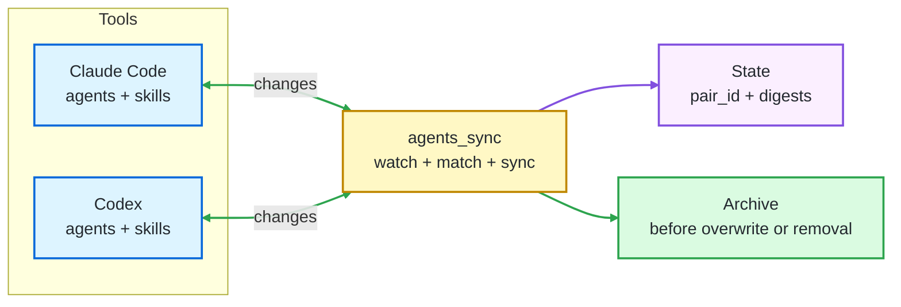

<p align="center">
  
</p>

<h1 align="center">agents_sync</h1>

<p align="center">
  
  
  
  
  
</p>

## 🎯 Purpose

`agents_sync` is a bidirectional bridge between Claude Code and Codex.

> It keeps your custom agents and skills in sync automatically, so you can build your AI workflow once and use it from both tools. Create or edit something in Claude Code, and it appears in Codex. Create or edit it in Codex, and it comes back to Claude Code.

The daemon runs quietly in the background, protects your content with archives, and keeps files connected even when they are renamed.

---

## 🗂️ Table Of Contents

- [What It Syncs](#what-it-syncs)
- [Bidirectional Sync](#bidirectional-sync)
- [Quick Start](#quick-start)
- [Daily Usage](#daily-usage)
- [Check That It Is Running](#check-that-it-is-running)
- [Run In Foreground For Debugging](#run-in-foreground-for-debugging)
- [Manage The Background Service](#manage-the-background-service)
- [Uninstall](#uninstall)
- [Default Paths](#default-paths)
- [Notes](#notes)
- [Changelog](#changelog)
- [Documentation](#documentation)
- [License](#license)

---

<a id="what-it-syncs"></a>

## 🧩 What It Syncs

`agents_sync` synchronizes the personal agents and skills you use with Claude Code and Codex.

| What you edit | Where Claude Code stores it | Where Codex stores it |
|:---|:---|:---|
| Agents | `~/.claude/agents/*.md` | `~/.codex/agents/*.toml` |
| Skills | `~/.claude/skills/*/SKILL.md` | `~/.agents/skills/*/SKILL.md` |

**In plain terms:**

- Agents are reusable AI personas or workflows.
- Skills are reusable instruction folders.



---

<a id="bidirectional-sync"></a>

## 🔁 Bidirectional Sync

`agents_sync` does not have a primary side. Claude Code and Codex can both be edited directly.

| Action | Result |
|:---|:---|
| Create or edit a Claude Code agent | Codex receives the matching `.toml` file |
| Create or edit a Codex agent | Claude Code receives the matching `.md` file |
| Create or edit a Claude Code skill | Codex receives the matching skill folder |
| Create or edit a Codex skill | Claude Code receives the matching skill folder |
| Remove one side of a synced pair | The other side is archived, then removed |

---

<a id="quick-start"></a>

## ⚡ Quick Start

### Linux

**Install `uv` if needed:**

```bash
curl -LsSf https://astral.sh/uv/install.sh | sh
```

**Install and start `agents_sync`:**

```bash
chmod +x install.sh
./install.sh
```

### Windows

**Install `uv` if needed:**

```powershell
winget install --id=astral-sh.uv -e
```

**Install and start `agents_sync`:**

```powershell
powershell -ExecutionPolicy Bypass -File .\install.ps1
```

The Windows installer registers a per-user scheduled task. It starts at logon without opening a terminal window.

### macOS

macOS support has not been tested yet; only Linux and Windows background install flows are documented and validated.

Verify it with [Check That It Is Running](#check-that-it-is-running).

---

<a id="daily-usage"></a>

## 🛠️ Daily Usage

After installation, there is nothing else to start manually:

- Linux runs `agents_sync` as a `systemd --user` service.
- Windows starts it through Task Scheduler when you log in.

Use Claude Code or Codex normally. Create, edit, rename, or remove agents and skills from either side; matching changes propagate automatically. Removals archive the opposite side before cleanup, and existing pairs keep their identity through `pair_id`.

---

<a id="check-that-it-is-running"></a>

## ✅ Check That It Is Running

This section only checks the background daemon. It confirms that the service exists, that it is active, and that the watcher has started writing logs.

### Linux

On Linux, `systemctl` shows the status of the per-user service. `journalctl` shows the latest service logs, which is the quickest way to confirm that `agents_sync` is watching your files.

```bash
systemctl --user status agents-sync.service
journalctl --user -u agents-sync.service -n 20
```

### Windows

On Windows, the scheduled task is the background launcher. After you log in, it should exist and stay in the `Running` state while the daemon is active.

```powershell
Get-ScheduledTask -TaskName agents-sync
```

**Expected state:**

```text
Running
```

**Recent logs:**

The log file confirms that the watcher loop has actually started.

```powershell
Get-Content "$env:LOCALAPPDATA\agents-sync\logs\agents-sync.log" -Tail 20
```

**Expected log line:**

```text
INFO Watching Claude agents/skills with SHA256 polling
```

---

<a id="run-in-foreground-for-debugging"></a>

## 🔎 Run In Foreground For Debugging

The normal install runs the daemon in the background. Use foreground mode only when debugging. Stop with `Ctrl-C`.

### Linux

```bash
agents-sync --config ~/.config/agents-sync/config.toml --verbose
```

### Windows

```powershell
& "$env:LOCALAPPDATA\agents-sync\bin\agents-sync.cmd" --config "$env:APPDATA\agents-sync\config.toml" --verbose
```

---

<a id="manage-the-background-service"></a>

## ⚙️ Manage The Background Service

### Linux

```bash
systemctl --user stop agents-sync.service
systemctl --user start agents-sync.service
journalctl --user -u agents-sync.service -f
```

### Windows

```powershell
Stop-ScheduledTask -TaskName agents-sync
Start-ScheduledTask -TaskName agents-sync
Get-Content "$env:LOCALAPPDATA\agents-sync\logs\agents-sync.log" -Tail 50
```

---

<a id="uninstall"></a>

## 🧹 Uninstall

### Linux

```bash
./uninstall.sh
```

### Windows

Remove the scheduled task and launchers:

```powershell
powershell -ExecutionPolicy Bypass -File .\uninstall.ps1
```

Also remove config and state:

```powershell
powershell -ExecutionPolicy Bypass -File .\uninstall.ps1 -CleanupData
```

---

<a id="default-paths"></a>

## 📁 Default Paths

| Platform | Config | State | Logs |
|:---|:---|:---|:---|
| Linux | `~/.config/agents-sync/config.toml` | `~/.local/state/agents-sync/` | `journalctl --user -u agents-sync.service` |
| Windows | `%APPDATA%\agents-sync\config.toml` | `%LOCALAPPDATA%\agents-sync\state\` | `%LOCALAPPDATA%\agents-sync\logs\agents-sync.log` |

**State layout:**

```text
state.json                                pair_id -> paths and digests
canonical/<pair_id>.json                  one canonical document per pair
archive/<pair_id>/<side>/<filename>.<ISO> preserved prior bytes
```

---

<a id="notes"></a>

## 📝 Notes

- The daemon polls both sides at a configurable interval.
- First sight of a Claude `.md`, Claude skill `SKILL.md`, Codex `.toml`, or Codex skill folder without a `pair_id` triggers adoption.
- Adoption archives the original, injects a `pair_id`, and creates the counterpart on the other side.
- Removing one side of a pair archives the other side and drops the pair from state.
- Missing or unreadable configured roots fail closed. A missing directory is never interpreted as "all files were deleted."
- Malformed `pair_id`s, duplicate IDs, and target path collisions are skipped with errors instead of being adopted or overwritten.
- A v0.1 `claude-codex-sync` install at `~/.config/claude-codex-sync/` or `~/.local/state/claude-codex-sync/` is not auto-migrated. The daemon errors out and asks you to remove or move those paths first.

---

<a id="changelog"></a>

## 🗓️ Changelog

### 0.3.0

- Added first-class Windows install and background supervision.
- Added hidden Windows startup through Task Scheduler without a visible terminal window.
- Added platform-aware defaults for config and state paths.
- Added filesystem retry hardening for transient Windows lock/share violations.
- Added Windows filename and path-collision safety checks.
- Added generated counterpart names that include the item kind.
- Added Linux and Windows CI coverage.

### 0.2.1

- Added fail-closed validation for configured sync roots.
- Rejected malformed or duplicate `pair_id` values before filesystem use.
- Added target collision checks for foreign artifact adoption.
- Added regression tests for v0.2.1 safety behavior.

---

<a id="documentation"></a>

## 📚 Documentation

- `docs/project_description.md` - purpose, scope, glossary.
- `docs/project_requirements.md` - functional and non-functional requirements.
- `docs/stories/US-XX-*.md` - user stories.
- `docs/v0.2_implementation_plan.md` - v0.2 engineering plan.
- `docs/v0.2.1_remediation_plan.md` - safety remediation plan.
- `docs/v0.3_implementation_plan.md` - Windows support plan.

---

<a id="license"></a>

## 📄 License

MIT License. See `LICENSE`.
