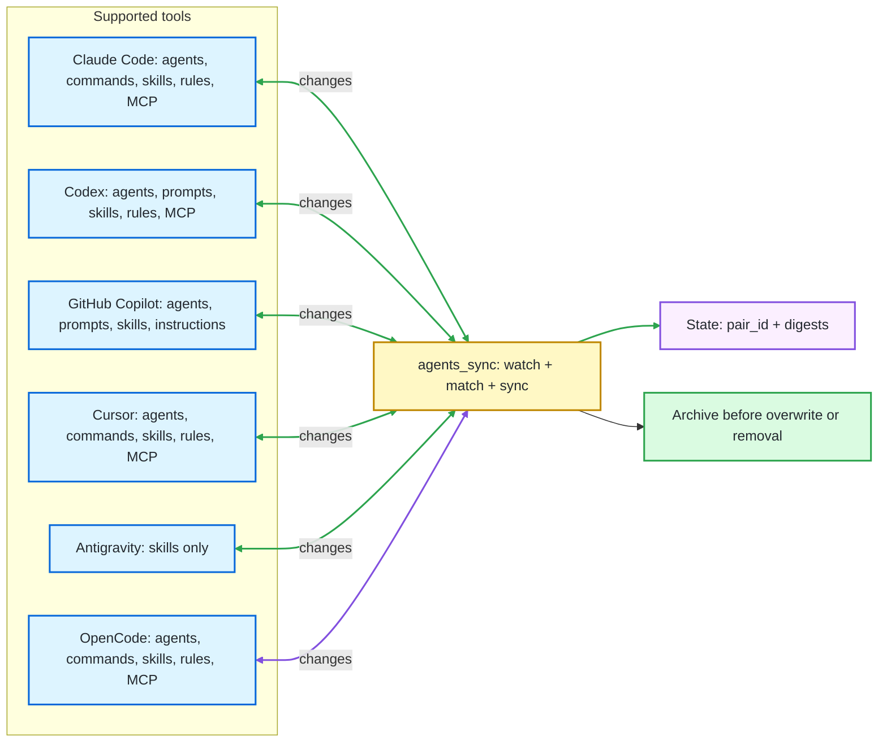

<p align="center">
  
</p>

<h1 align="center">agents_sync</h1>

<p align="center">
  
  
  
  
  
  
</p>

## 🎯 Purpose

`agents_sync` keeps your user-level custom agents, skills, commands, rules, and MCP servers in sync across **Claude Code**, **Codex**, **GitHub Copilot**, **Cursor**, **Gemini CLI**, **Google Antigravity**, and **OpenCode**.

> Build your AI workflow once and use it from every tool you've installed. Skills and agents are shared across connected tools where they are supported. Create or edit one anywhere, and it syncs everywhere else automatically. (Antigravity has no stable per-agent file format yet).

The daemon runs quietly in the background, protects your content with archives, and keeps user-level files connected even when they are renamed. If one of the tools isn't installed, that tool is silently skipped — the others continue to sync.

---

## 🗂️ Table Of Contents

- [What It Syncs](#what-it-syncs)
- [Bidirectional Sync](#bidirectional-sync)
- [Quick Start](#quick-start)
- [Daily Usage](#daily-usage)
- [Check That It Is Running](#check-that-it-is-running)
- [Run In Foreground For Debugging](#run-in-foreground-for-debugging)
- [Manage The Background Service](#manage-the-background-service)
- [Backup, Restore, Share](#backup-restore-share)
- [Uninstall](#uninstall)
- [Default Paths](#default-paths)
- [Notes](#notes)
- [Changelog](#changelog)
- [Documentation](#documentation)
- [License](#license)

---

<a id="what-it-syncs"></a>

## 🧩 What It Syncs

`agents_sync` synchronizes user-level agents, skills, slash commands, global rules, and MCP servers across the tools that expose each customization type.

| What you edit | Claude Code | Codex | GitHub Copilot | Cursor | Gemini CLI | Antigravity | OpenCode |
|:---|:---|:---|:---|:---|:---|:---|:---|
| Agents | `~/.claude/agents/*.md` | `~/.codex/agents/*.toml` | `~/.copilot/agents/*.agent.md` | `~/.cursor/agents/*.md` | `~/.gemini/agents/*.md` | n/a (no per-agent format) | `~/.config/opencode/agents/*.md` |
| Skills | `~/.claude/skills/*/SKILL.md` | `~/.codex/skills/*/SKILL.md` | `~/.copilot/skills/*/SKILL.md` | `~/.cursor/skills/*/SKILL.md` | `~/.gemini/skills/*/SKILL.md` | `~/.gemini/antigravity/skills/*/SKILL.md` | `~/.config/opencode/skills/*/SKILL.md` |
| Slash commands | `~/.claude/commands/*.md` | `~/.codex/prompts/*.md` | VS Code user profile `*.prompt.md` | `~/.cursor/commands/*.md` | `~/.gemini/commands/*.toml` | n/a (skills only) | `~/.config/opencode/commands/*.md` |
| Rules | `~/.claude/CLAUDE.md` | `~/.codex/AGENTS.md` | VS Code user profile `*.instructions.md` | `~/.cursor/rules/*.mdc` | `~/.gemini/GEMINI.md` | n/a | `~/.config/opencode/AGENTS.md` |
| MCP servers | `~/.claude.json[mcpServers]` | `~/.codex/config.toml[mcp_servers]` | n/a | `~/.cursor/mcp.json[mcpServers]` | n/a | n/a | `~/.config/opencode/opencode.json[mcp]` |

**In plain terms:**

- Skills are reusable instruction folders. Claude Code, Codex, Copilot, Cursor, Antigravity, and OpenCode use `SKILL.md` folders, so skills sync six ways.
- Agents are reusable AI personas. Claude Code, Codex, Copilot, Cursor, Gemini CLI, and OpenCode have per-agent file formats.
- Slash commands are reusable prompt files invoked from chat. Claude Code, Codex, Copilot, Cursor, Gemini CLI, and OpenCode sync them as files.
- Rules are global instruction files. Claude Code uses `CLAUDE.md`; Codex and OpenCode use `AGENTS.md`; Copilot uses VS Code `*.instructions.md`; Cursor uses `.mdc`; Gemini CLI uses `GEMINI.md`.
- MCP servers sync across Claude Code, Codex, Cursor, and OpenCode. Project-scoped MCP files remain out of scope.



---

<a id="bidirectional-sync"></a>

## 🔁 Bidirectional Sync

`agents_sync` treats every configured tool as an equal peer. Edit on any one tool and the change propagates to every other tool that supports the same kind of customization.

| Action | Result |
|:---|:---|
| Create or edit an agent in Claude Code, Codex, Copilot, Cursor, Gemini CLI, or OpenCode | The other agent-capable tools receive matching agent files |
| Create or edit a skill on any tool | The other skill-capable tools receive the matching `SKILL.md` folder |
| Create or edit a slash command in Claude Code, Codex, Copilot, Cursor, Gemini CLI, or OpenCode | The other slash-command tools receive matching command files |
| Two or more tools edit the same customization simultaneously | The most recently modified copy wins; the losers are archived |
| Remove a synced customization on any tool | The other tools' copies are archived, then removed |
| A tool's directory is missing at startup | That tool is marked unavailable; the others continue to sync, and nothing is interpreted as a deletion |

---

<a id="quick-start"></a>

## ⚡ Quick Start

### Linux

**Install `uv` if needed:**

```bash
curl -LsSf https://astral.sh/uv/install.sh | sh
```

**Install and start `agents_sync`:**

```bash
chmod +x install.sh
./install.sh
```

### Windows

**Install `uv` if needed:**

```powershell
winget install --id=astral-sh.uv -e
```

**Install and start `agents_sync`:**

```powershell
powershell -ExecutionPolicy Bypass -File .\install.ps1
```

The Windows installer registers a per-user scheduled task. It starts at logon without opening a terminal window.

### macOS

**Install `uv` if needed:**

```bash
curl -LsSf https://astral.sh/uv/install.sh | sh
```

**Install and start `agents_sync`:**

```bash
chmod +x install-macos.sh
./install-macos.sh
```

The macOS installer registers a per-user LaunchAgent. It starts at login and keeps the daemon running in the background.

Verify it with [Check That It Is Running](#check-that-it-is-running).

### Enabling Antigravity

Antigravity is enabled by default. The daemon creates `~/.gemini/antigravity/skills/` at startup if it does not already exist, so the first poll syncs skills from Claude Code, Codex, Cursor, and OpenCode into it. Antigravity itself picks up the directory on its next read.

To disable Antigravity entirely, set `antigravity_enabled = false` in your `config.toml`, or pass `--no-antigravity-enabled` on the command line. A disabled tool's roots are not created. The skills directory can be relocated with `antigravity_skills_dir` in `config.toml` or `--antigravity-skills-dir`.

### Enabling Cursor

Cursor is enabled by default. The daemon uses `~/.cursor/agents/`, `~/.cursor/skills/`, `~/.cursor/rules/`, `~/.cursor/commands/`, and `~/.cursor/mcp.json` for user-level syncable files.

To disable Cursor entirely, set `cursor_enabled = false` in your `config.toml`, or pass `--no-cursor-enabled` on the command line. Cursor slash-command identity is stored as a first-line HTML comment because Cursor commands are plain Markdown files.

### Enabling OpenCode

OpenCode is enabled by default. On Linux and macOS the daemon uses `~/.config/opencode/agents/`, `~/.config/opencode/commands/`, `~/.config/opencode/skills/`, and `~/.config/opencode/AGENTS.md`. On Windows the default is under `%APPDATA%\opencode\`; run `opencode debug paths` if your OpenCode build reports a different config root, then override `opencode_agents_dir`, `opencode_commands_dir`, `opencode_skills_dir`, and `opencode_rules_dir`.

To disable OpenCode entirely, set `opencode_enabled = false` in your `config.toml`, or pass `--no-opencode-enabled` on the command line.

---

<a id="daily-usage"></a>

## 🛠️ Daily Usage

After installation, there is nothing else to start manually:

- Linux runs `agents_sync` as a `systemd --user` service.
- macOS runs `agents_sync` as a per-user LaunchAgent.
- Windows starts it through Task Scheduler when you log in.

Use Claude Code, Codex, GitHub Copilot, Cursor, Gemini CLI, Antigravity, or OpenCode normally. Create, edit, rename, or remove supported customizations from any supported tool; matching changes propagate automatically. Removals archive the other tools before cleanup, and existing pairs keep their identity through `pair_id`.

---

<a id="check-that-it-is-running"></a>

## ✅ Check That It Is Running

This section only checks the background daemon. It confirms that the service exists, that it is active, and that the watcher has started writing logs.

### Linux

On Linux, `systemctl` shows the status of the per-user service. `journalctl` shows the latest service logs, which is the quickest way to confirm that `agents_sync` is watching your files.

```bash
systemctl --user status agents-sync.service
journalctl --user -u agents-sync.service -n 20
```

### Windows

On Windows, the scheduled task is the background launcher. After you log in, it should exist and stay in the `Running` state while the daemon is active.

```powershell
Get-ScheduledTask -TaskName agents-sync
```

**Expected state:**

```text
Running
```

**Recent logs:**

The log file confirms that the watcher loop has actually started.

```powershell
Get-Content "$env:LOCALAPPDATA\agents-sync\logs\agents-sync.log" -Tail 20
```

**Expected log line:**

```text
INFO Watching configured agent and skill roots with SHA256 polling
```

### macOS

On macOS, `launchctl` shows the status of the per-user LaunchAgent. The installer writes stdout and stderr logs under `~/Library/Logs/agents-sync/`.

```bash
launchctl print "gui/$(id -u)/com.agents-sync.daemon"
tail -n 20 ~/Library/Logs/agents-sync/agents-sync.log
```

---

<a id="run-in-foreground-for-debugging"></a>

## 🔎 Run In Foreground For Debugging

The normal install runs the daemon in the background. Use foreground mode only when debugging. Stop with `Ctrl-C`.

### Linux

```bash
agents-sync --config ~/.config/agents-sync/config.toml --verbose
```

### Windows

```powershell
& "$env:LOCALAPPDATA\agents-sync\bin\agents-sync.cmd" --config "$env:APPDATA\agents-sync\config.toml" --verbose
```

### macOS

```bash
agents-sync --config ~/.config/agents-sync/config.toml --verbose
```

---

<a id="manage-the-background-service"></a>

## ⚙️ Manage The Background Service

### Linux

```bash
systemctl --user stop agents-sync.service
systemctl --user start agents-sync.service
journalctl --user -u agents-sync.service -f
```

### Windows

```powershell
Stop-ScheduledTask -TaskName agents-sync
Start-ScheduledTask -TaskName agents-sync
Get-Content "$env:LOCALAPPDATA\agents-sync\logs\agents-sync.log" -Tail 50
```

### macOS

```bash
launchctl bootout "gui/$(id -u)" ~/Library/LaunchAgents/com.agents-sync.daemon.plist
launchctl bootstrap "gui/$(id -u)" ~/Library/LaunchAgents/com.agents-sync.daemon.plist
tail -f ~/Library/Logs/agents-sync/agents-sync.log
```

---

<a id="backup-restore-share"></a>

## 💾 Backup, Restore, Share

`agents_sync` can serialise your entire managed library into a single zip file. The same file restores onto another install, or seeds a teammate's machine.

```bash
agents-sync export ~/my-library.zip
agents-sync import ~/my-library.zip
```

The archive contains one canonical document per managed artifact plus a small manifest. It deliberately excludes `state.json` and the on-disk `archive/` directory — those hold host-specific bytes. On import, every artifact is rendered onto every locally enabled, supporting, and available agentic_tool before the command returns; the daemon does not need to be running.

When an imported artifact collides with a locally-managed one (same `pair_id`, or same slugified name under the same kind), `import` consults the `import_collision_strategy` setting:

| Strategy | Behaviour |
|:---|:---|
| `mtime_wins` (default) | The candidate with the higher `last_modified` wins. Ties favour the local artifact. |
| `skip` | Imported artifact ignored; local artifact untouched. |
| `overwrite` | Imported artifact replaces local unconditionally; local bytes archived first. |

Override per invocation with `--collision-strategy`:

```bash
agents-sync import ~/my-library.zip --collision-strategy overwrite
```

Or set the default in `config.toml`:

```toml
[agents-sync]
import_collision_strategy = "mtime_wins"
```

Every operation that would displace local bytes archives them first under `<state_dir>/archive/<pair_id>/<tool>/` (NFR-01), so an unwanted import is recoverable.

---

<a id="uninstall"></a>

## 🧹 Uninstall

### Linux

```bash
./uninstall.sh
```

### Windows

Remove the scheduled task and launchers:

```powershell
powershell -ExecutionPolicy Bypass -File .\uninstall.ps1
```

Also remove config and state:

```powershell
powershell -ExecutionPolicy Bypass -File .\uninstall.ps1 -CleanupData
```

---

<a id="default-paths"></a>

## 📁 Default Paths

| Platform | Config | State | Logs |
|:---|:---|:---|:---|
| Linux | `~/.config/agents-sync/config.toml` | `~/.local/state/agents-sync/` | `journalctl --user -u agents-sync.service` |
| macOS | `~/.config/agents-sync/config.toml` | `~/.local/state/agents-sync/` | `~/Library/Logs/agents-sync/agents-sync.log` |
| Windows | `%APPDATA%\agents-sync\config.toml` | `%LOCALAPPDATA%\agents-sync\state\` | `%LOCALAPPDATA%\agents-sync\logs\agents-sync.log` |

**Synced roots:**

| Tool | Agents | Slash commands | Skills | Rules | MCP servers |
|:---|:---|:---|:---|:---|:---|
| Claude Code | `~/.claude/agents` | `~/.claude/commands` | `~/.claude/skills` | `~/.claude/CLAUDE.md` | `~/.claude.json[mcpServers]` |
| Codex | `~/.codex/agents` | `~/.codex/prompts` | `~/.codex/skills` | `~/.codex/AGENTS.md` | `~/.codex/config.toml[mcp_servers]` |
| GitHub Copilot | `~/.copilot/agents` | configured VS Code profile prompts dir | `~/.copilot/skills` | configured VS Code profile instructions dir | n/a |
| Cursor | `~/.cursor/agents` | `~/.cursor/commands` | `~/.cursor/skills` | `~/.cursor/rules/*.mdc` | `~/.cursor/mcp.json[mcpServers]` |
| Antigravity | n/a | n/a | `~/.gemini/antigravity/skills` | n/a | n/a |
| OpenCode | `~/.config/opencode/agents` | `~/.config/opencode/commands` | `~/.config/opencode/skills` | `~/.config/opencode/AGENTS.md` | `~/.config/opencode/opencode.json[mcp]` |

**State layout:**

```text
state.json                                pair_id -> paths and digests
canonical/<pair_id>.json                  one canonical document per pair
archive/<pair_id>/<tool>/<filename>.<ISO> preserved prior bytes
```

---

<a id="notes"></a>

## 📝 Notes

- The daemon polls every configured tool at a configurable interval.
- First sight of any managed customization file without a `pair_id` triggers adoption.
- Adoption archives the original, injects a `pair_id`, and creates the counterpart on every other tool that supports that kind of customization.
- Removing a synced customization on any one tool archives every surviving tool's copy before removing it.
- On startup the daemon creates each enabled tool's configured roots (`mkdir -p`) so a fresh install where the tool hasn't authored anything yet still comes up `available`. If creating a root fails (permission denied, parent is a file), or a root disappears mid-life (drive unmounted, tool uninstalled), the tool flips to `unavailable` for that poll and the daemon keeps running over the remaining `available` tools — your library stays intact (US-11).
- Malformed `pair_id`s, duplicate IDs, and target path collisions are skipped with errors instead of being adopted or overwritten.
- **Cursor limitations:** only user-level file surfaces under `~/.cursor/` are synced. Cursor's SQLite/cloud-backed state, including in-app User Rules, Custom Modes, Notepads, memories, account settings, Background Agents, hooks, project `.cursor/` files, and ignore files, is intentionally out of scope. Put syncable global rules in `~/.cursor/rules/*.mdc`.
- **Antigravity on Windows:** Antigravity v1.19.6 has a known bug where the user-level skills directory is read as `~/.gemini/antigravity/global_skills/` instead of `skills/`. The daemon does not auto-detect this; if you are on an affected version, set `antigravity_skills_dir` to your `global_skills` path in `config.toml`.
- **MCP scope:** MCP server sync is user-level only. Claude Code project `.mcp.json`, Codex project `.codex/config.toml`, Cursor project `.cursor/mcp.json`, and project `opencode.json` are intentionally outside the default daemon scope.
- **OpenCode on Windows:** OpenCode path reporting has differed between docs and runtime builds. The default uses `%APPDATA%\opencode\`; if `opencode debug paths` reports `%USERPROFILE%\.config\opencode\` or another root, override `opencode_agents_dir`, `opencode_commands_dir`, `opencode_skills_dir`, `opencode_rules_dir`, and `opencode_config_file`.
- **GitHub Copilot limitations:** this adapter manages user-level Copilot CLI agents and skills plus explicitly configured VS Code user-profile instructions and prompts. It does not sync repository `.github/` files, workspace `.vscode/mcp.json`, GitHub.com organization customizations, Copilot cloud agent settings, hooks, plugin packages, extension-contributed customizations, or MCP servers yet.
- This tool was developed with the support of Claude Code, Codex, GitHub Copilot, Cursor, Google Antigravity, and OpenCode.

---

<a id="changelog"></a>

## 🗓️ Changelog

### Unreleased

- Added Cursor support for agents, skills, rules, slash commands, and MCP servers under the user-level `~/.cursor/` file surfaces.
- Added GitHub Copilot support for CLI agents, Agent Skills, VS Code user-profile instructions, and VS Code user-profile prompt files.
- Added slash-command sync for Claude Code (`~/.claude/commands`), Codex (`~/.codex/prompts`), Copilot (VS Code profile `*.prompt.md`), Cursor (`~/.cursor/commands`), Gemini CLI (`~/.gemini/commands`), and OpenCode (`~/.config/opencode/commands`).
- Added command-root config keys and CLI overrides including `claude_commands_dir`, `codex_prompts_dir`, Copilot VS Code prompt/instruction roots, `cursor_commands_dir`, `gemini_cli_commands_dir`, and `opencode_commands_dir`.
- Added `mcp_server` sync for Claude Code (`~/.claude.json[mcpServers]`), Codex (`~/.codex/config.toml[mcp_servers]`), Cursor (`~/.cursor/mcp.json[mcpServers]`), and OpenCode (`opencode.json[mcp]`), including per-slot archive/removal behaviour.
- Added a generic `secret_policy` config key (`secrets_refused` / `secrets_accepted`, default `secrets_refused`) — type-agnostic (today only `mcp_server` artifacts can carry literal secret material; future customization_types fall under the same rules). The policy is enforced at every artifact-egress boundary: parse (`secrets_refused` rejects the artifact; `secrets_accepted` admits it with a warning), customization library export (`secrets_refused` skips secret-bearing canonicals per-artifact with a warning; `secrets_accepted` ships them verbatim, the manifest flags `contains_secret_literals=true`), and customization library import (receiver's policy always overrides the source-host policy).
- Deprecated the older `mcp_server_secret_policy` config key and its `refuse` / `redact` / `permissive` values. Both keys and all value spellings still work for one release with a startup deprecation log; `redact` mode is removed and maps to `secrets_refused` (the safer default).

### 0.4.3

- Added portable library snapshot: `agents-sync export <file.zip>` serialises every managed agent and skill into a single zip, and `agents-sync import <file.zip>` restores or merges that zip into a local install. See [Backup, Restore, Share](#backup-restore-share).
- Added `import_collision_strategy` config key (`skip` / `mtime_wins` / `overwrite`, default `mtime_wins`) controlling how an imported artifact reconciles with a locally-managed one. CLI flag `--collision-strategy` overrides per invocation.
- Bumped `state.json` to `schema_version: 3` with a per-pair `last_modified` timestamp (the source of truth for the `mtime_wins` collision rule). Pre-1.0 cutover: v2 state files are regenerated on first boot.
- Imports project every accepted artifact onto every available agentic_tool synchronously, before the command returns — the daemon does not need to be running. Displaced local bytes are archived under the existing `archive/<pair_id>/<tool>/` layout per NFR-01.

### 0.4.1

- Added OpenCode as an agentic tool. Agents now sync three ways across Claude Code, Codex, and OpenCode.
- Restored Codex custom agents under `~/.codex/agents/*.toml`.
- Skills now include OpenCode as an additional sync participant.
- Added OpenCode agent and skill roots with `opencode_agents_dir`, `opencode_skills_dir`, and `opencode_enabled` config/CLI wiring.
- Preserved OpenCode-only metadata such as `mode`, `permission`, `steps`, `color`, and open-spec skill metadata without leaking foreign fields into OpenCode files.

### 0.4.0

- Added Google Antigravity as a third agentic tool. Antigravity participates in skills only.
- Codex agent sync was temporarily removed in v0.4, then restored in v0.4.1.
- The default `codex_skills_dir` is now `~/.codex/skills` (the path Codex's own `skill-installer` and `skill-creator` use). The v0.3-era `~/.agents/skills` default never matched a live Codex install.
- Daemon-projected counterparts use the bare slugified name. The v0.3 `-skill` / `-agent` suffix is dropped — agents and skills live in distinct config-keyed roots, so kind disambiguation is unnecessary. A skill named `formatter` now lives at `<root>/formatter/SKILL.md` on every tool instead of `<root>/formatter-skill/SKILL.md`.
- On startup the daemon creates each enabled tool's roots if they don't exist (`mkdir -p`). Mid-life loss of a root still flips a tool to `unavailable` per US-11.
- Agents (per-agent files) were therefore Claude-only in v0.4. v0.4.1 restores Codex custom agents under `~/.codex/agents/*.toml` and adds OpenCode as an agent sync target.
- Generalised the sync algorithm from two named peers (`claude` / `codex`) to an N-tool registry. Adding another agentic tool is now an IO module + a config entry; the sync engine, conflict resolution, adoption, reconciliation, and removal-propagation paths are tool-agnostic.
- Replaced the v0.2.1 "exit on missing root" startup behavior with per-tool status (`available` / `unavailable` / `disabled`). A missing root marks the tool unavailable for that poll and is logged once; the daemon continues to sync the remaining available tools. Removal-propagation never fires from an unavailable tool, so an uninstalled or unmounted tool never wipes your library.
- Added first-boot reconciliation: when the same logical skill exists on multiple tools without a `pair_id`, the daemon merges them by most-recent mtime instead of failing on a slug collision.
- Bumped `state.json` to `schema_version: 2` (per-tool dicts under `customization_artifacts`). Pre-1.0 cutover: existing state files are regenerated on first boot.

### 0.3.0

- Added first-class Windows install and background supervision.
- Added hidden Windows startup through Task Scheduler without a visible terminal window.
- Added platform-aware defaults for config and state paths.
- Added filesystem retry hardening for transient Windows lock/share violations.
- Added Windows filename and path-collision safety checks.
- Added generated counterpart names that include the item kind.
- Added Linux and Windows CI coverage.

### 0.2.1

- Added fail-closed validation for configured sync roots.
- Rejected malformed or duplicate `pair_id` values before filesystem use.
- Added target collision checks for foreign artifact adoption.
- Added regression tests for v0.2.1 safety behavior.

---

<a id="documentation"></a>

## 📚 Documentation

- `docs/project_description.md` - purpose, scope, glossary.
- `docs/project_requirements.md` - functional and non-functional requirements.
- `docs/stories/US-XX-*.md` - user stories.
- `docs/v0.2_implementation_plan.md` - v0.2 engineering plan.
- `docs/v0.2.1_remediation_plan.md` - safety remediation plan.
- `docs/v0.3_implementation_plan.md` - Windows support plan.
- `docs/v0.4_implementation_plan.md` - Antigravity / N-tool sync plan.
- `docs/v0.4.1_implementation_plan.md` - OpenCode integration follow-up plan.
- `docs/agentic_tool_integration_protocol.md` - how to add another agentic tool.

---

<a id="license"></a>

## 📄 License

MIT License. See `LICENSE`.
